# Microprocesadores

## Organización y Arquitectura

Cuando se describe un computador, frecuentemente se distingue entre arquitectura y organización.

* **Arquitectura**.- son los atributos de un sistema que son visibles para un programador, es decir aquellos atributos que tiene un impacto en la ejecución lógica de un programa. (conjunto de instrucciones, Nro. de bits usados para representar varios tipos de datos, mecanismos de E/S y las técnicas para direccionamiento de memoria.) (PARTE PROGRAMACIÓN)
* **Organización**.- Se refiere a las unidades funcionales y sus interconexiones, que dan lugar a especificaciones arquitectónicas. (señales de control, interfaces entre el computador y los periféricos y la tecnología de memoria usada. ).

Entre los ejemplos de atributos arquitectónicos se encuentran el conjunto de instrucciones, el número de bits usados para representar tipos de datos (por ejemplo, numero, caracteres), mecanismos de E/S y tecnicas para direccionamiento de memoria.

Entre los atributos de organizaión se incluyen aquellos detalles de hardware transparentes al programador, tales como señales de control, interfaces entre el computador y los periféricos y la tecnología de memoria usada.

Para poner un ejemplo, una cuestión de diseño arquitectónico es si el computador tendrá la instrucción de multiplicar. Una cuestion de organización es si esa instrucción será implementada por una unidad especializada en multiplicar o por un mecanismo que haga un uso iterativo de la unidad de suma del sistema. La decisión de organizacion puede estar basada en la frecuencia prevista del uso de la instrucción de multiplicar la velocidad relativa de las dos aproximaciones, y el coste y el tamaño fisico de una unidad especializada en multiplicar.

> Una arquitectura puede sobrevivir muchos años, pero su organización cambia con la evolución de tecnología

## Estructura y Funcionamiento

Un computador es un sistema complejo; los computadores de hoy en día contienen millones de componentes electrónicos básicos ¿Cómo podríamos describirlos claramente? La clave esta en reconocer la naturaleza jerárquica de la maoria de los sistemas complejos. Un **Sistema jerárquico**: Conjunto de subsistemas interrelacionados cada uno de los cuales, a su vez, se organiza en una estructura jerárquica hasta que se alcanza el nivel más bajo del subsistema elemental.

* **Estructura**.- Es el modo en que los componentes están interrelacionados. (Unidireccional o Bidireccional)

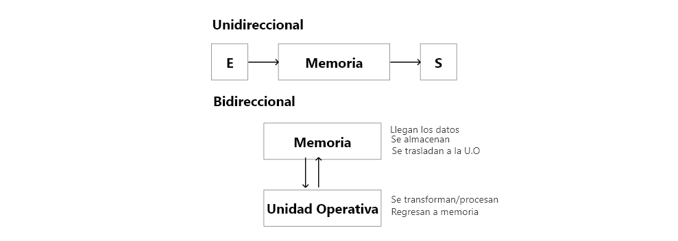
* **Funcionamiento**.- La operación de cada componente idividual como parte de la estructura

## FUNCIONAMIENTO

(En funcion al origen y destino de los datos - manejo de la información)

La figura 1.1 señala las funciones básicas que un computador puede llevar a cabo. En terminos generales hay solo cuatro:

* Procesamiento de datos
* Almacenamiento de datos
* Transferencia de datos
* Control

El computador, por supuesto, tiene que ser capaz de **procesar datos**. Los datos pueden adoptar una gran variedad de formas, y el rango de los requisitos de procesado es amplio. Sin embargo, veremos que hay solo unos pocos métodos o tipos fundamentales de procesado de datos.

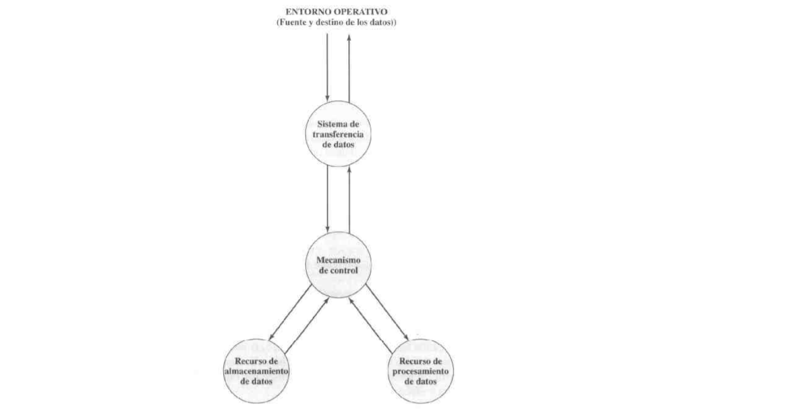
**Figura 1.1.** Una visión funcional de un computador

El computador tiene que ser capaz de **transferir datos** entre él mismo y el mundo exterior. Cuando se reciben o se llevan datos a un dispositivo que esta conectado con el computador, el proceso se le conoce como *entrada-salida (E/S)*, y este dispositivo recibe el nombre de periférico. El proceso de transferir datos a largas distancias, desde o hacia un dispositivo remoto, recibe el nombre de *comunicación de datos*. (Ver a)

Funciona como un dispositivo de almacenamiento de datos, con datos transferidos desde un entorno externo al almacén de datos del computador (leer) y viceversa (escribir) (Ver b)

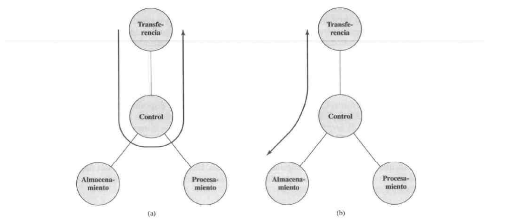

Los dos diagramas siguientes muestran operaciones que implican procesamiento de datos, en datos almacenados. O bien en tránsito entre el almacén y entorno externo.

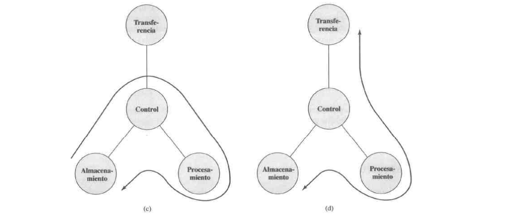

## Estructura

El computador es una entidad que interactúa de alguna manera con su entorno exterior. Todas sus conexiones con el entorno externo pueden ser clasificadas como dispositivos periféricos o líneas de comunicación. (Ver figura 1.3 El computador)

* **Bús único** Al final `el bus es único` osea existe una única linea de comunicación, sino que por fines didácticos se los divide de acuerdo a la información que vaya a tratar. Tenemos **bus de direcciones**, **bus de datos**, **bus de control**, **bus de instrucciones**, etc.

Hay cuatro componentes estructurales principales en la estructura interna del computador:

* **Unidad Central de Procesamiento (CPU, Central Processing Unit):** Controla el funcionamiento del computador y lleva a cabo sus funciones de procesamiento de datos. Frecuentemente se llama simplemente **procesador**.
* **Memoria Principal:** Almacena datos
* **E/S:** Transfiere datos entre el computador y el entorno externo
* **Sistema de interconexión:** Es un mecanismo que proporciona la comunicación entre la CPU , la memoria principal y la E/S.

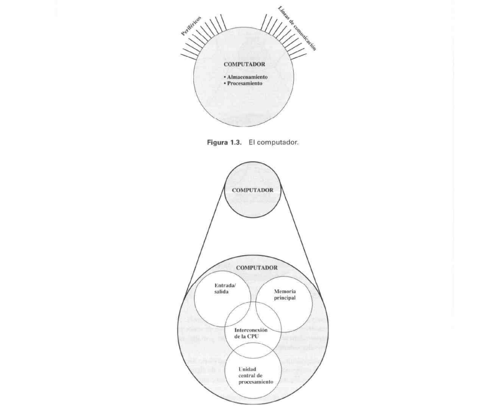

El componente más interesante para nosotros es el CPU. Sus principales componentes estructurales son:
* **Unidad de control** Controla el funcionamiento de la CPU y por tanto del computador

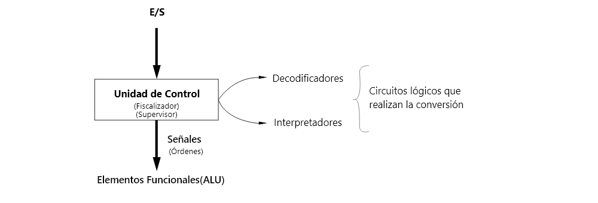

* **Unidad Aritmético-lógico (ALU, Arithmetic Logic Unit):** Lleva a cabo las funciones de procesamiento de datos del computador
  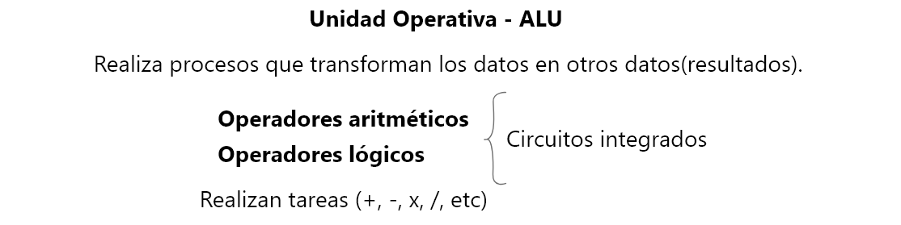
* **Registros:** Proporcionan almacenamiento interno a la CPU, Existen memorias internas(en un inicio) externas e intermedias que son lo que ahora se usa por su capacidad(memoria nivel 1, nivel2 Se les conoce como memoria cache). Los registros trabajan en conjunto para almacenar.
  
  * **Externos** Realizan los direccionamientos de memoria, alberga información que esta fuera del procesador. Existen 14 registros.
  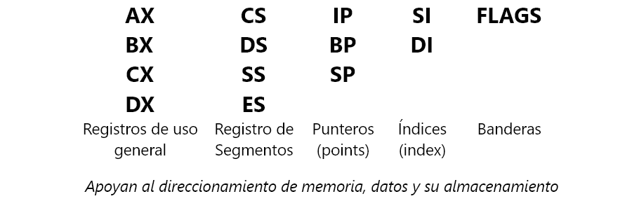
    * **AX**.- Se almacenan resultados, la parte más significativa.
    * **BX**.- Segunda parte de una dirección de memoria, parte de desplazamiento offset
    * **CX**.- Estructura loop, Es un contador que sirve como reloj, en el sentido de que las operaciones se tengan que realizar en tiempos equitativos. Envia una señal por cada operación hasta llegar a cero.
    * **DX**.- Almacena la parte menos significativa que es un resultado de la ALU.
    * **CS**.- Segmento de código (forman parte de una dirección)
    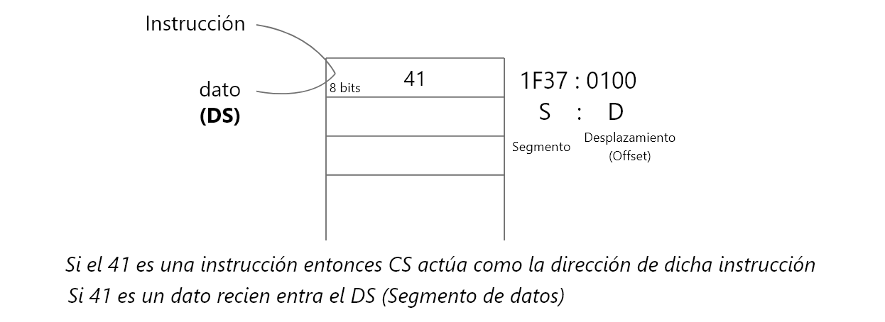
    * **SS**.- Dirección con pilas. Es una pila que contiene los datos e instrucciones.
    * **ES**.- Cuando el *DS* desborda se apoya en el *ES*(Segmento extra)
    * **PI**.- Trabaja con un registro interno. Puntero de instrucciones(Almacena la dirección de la siguiente instrucción)
    * **BP**.- Puntero de la base de la pila, cuando ya tenga un SS
    * **SP**.- Puntero que apunta a toda la pila.
    
    * **SI**.- Sort index
    * **DI**.- Destination index
    * **Flags**.- (Estados) o las señales que se van a generar (1 bit yes, not) Funciones de desborde, acarreo, cero, etc.
    * A partir del cpu 386, 486 los registros se pueden expandir
    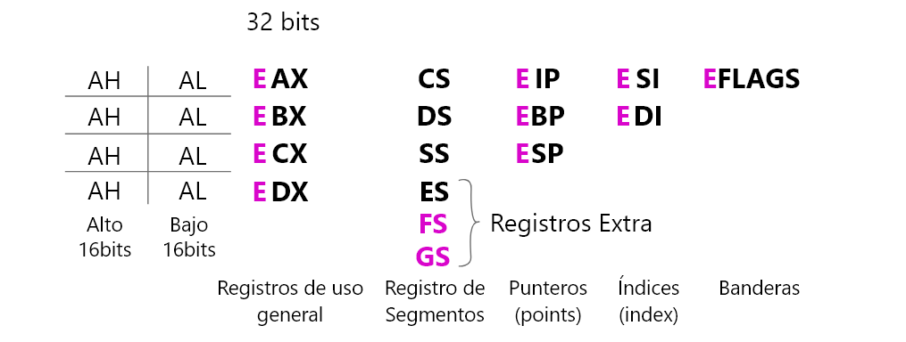
* **Interconexiones CPU** (buses)Son mecanismos que proporcionan comunicación entre la unidad de control, ALU, y los registros. Son de tipo bidireccional en la gran mayoría.

### Ciclo de instrucción
* **Subciclo de captación** Consiste en el proceso en donde los datos y las instrucciones pasan desde la memoria a los registros internos.
* **Subciclo de captación** Transferencia de las instruucciones de memoria -> Pasar por cada uno de los registros hasta que llege al registro de instrucciones (IR)
* **Ciclo de instrucción** Va a estar compuestra por dos subciclos, un subciclo de captación y otro de ejecución

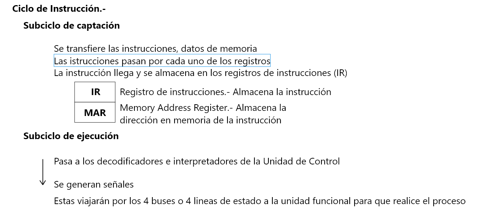

* transferencia sincrona.- RS-422-A - Apple tiempos de transferencia iguales(conocidos) permite planificación
* transferencia asincrona.- tiempos de transferencia eran diferentes RS-232-C -> IBM
* transferencia paralela
* transferencia serial

