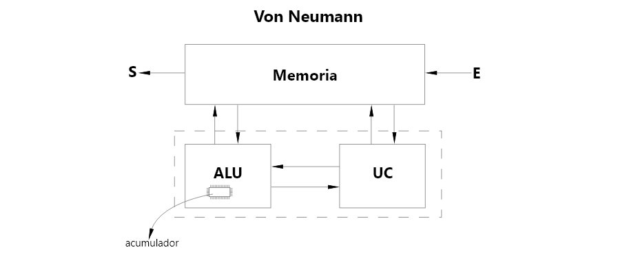
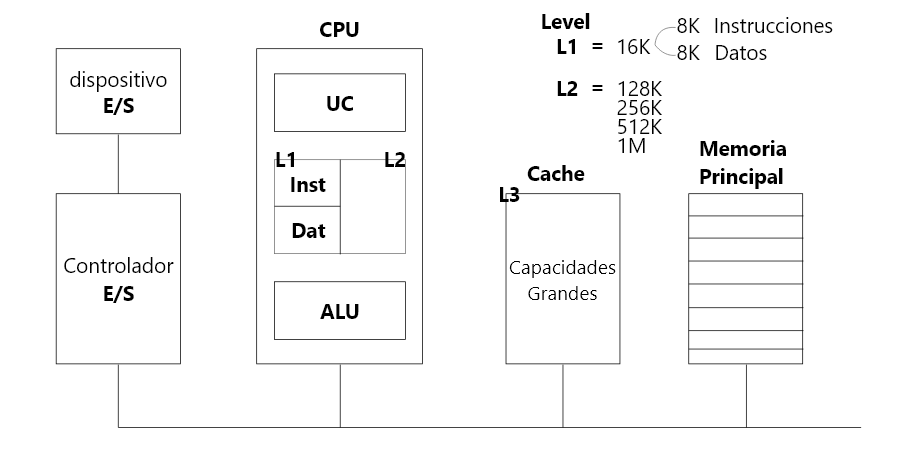
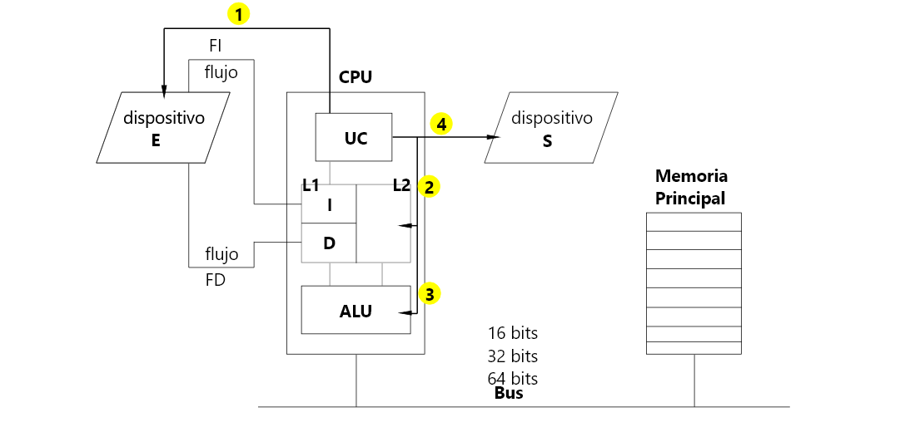
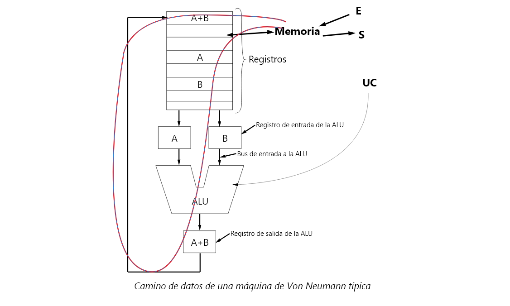
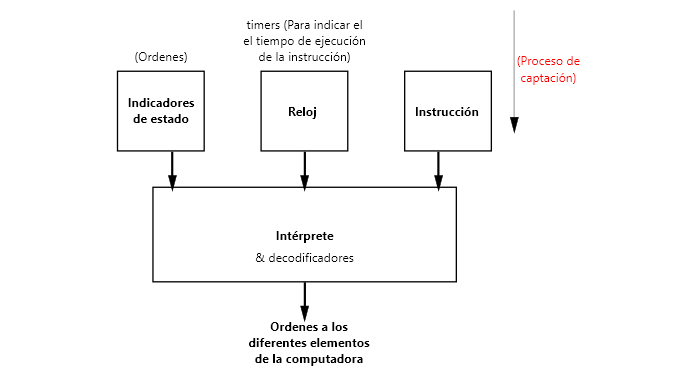
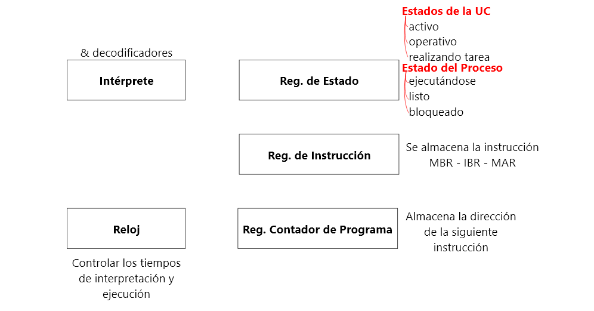

# Estructura Lógica del procesador (Von Neumann)

La unidad central de procesamiento (CPU).- De los programas alamacenados en la memoria central toma sus instrucciones, las examina y luego las ejecuta una tras otra. Los componentes están conectados por un Bus por donde transmite direcciones, datos y señales de control.

Actualmente del modelo de Neumann, la *memoria* u la *UC* es unidireccional **Memoria -> UC** y la *ALU* con la *UC*  tambien **UC -> ALU**. Y el pequeño circuito integrado por todo un conjunto de registros.

## Elementos funcionales de la CPU

* La unidad de control se encarga de traer las instrucciones de la memoria principal y de determinar su tipo
* La unidad aritmética y lógica realiza operaciones como la suma o la función booleana AND, necesarias para llevar a cabo las instrucciones.
* La CPU tambien contiene una pequeña memoria de alta velocidad utilizada para almacenar resultados intermedios utilizada para almacenar resultados intermedios y cierta información de control. Esta memoria consta de varios registros, cada uno de los cuales tiene cierto tamaño y función.
  * Contador de Programa (CP), que indica la próxima instrucción que debe ejecutarse.
  * Registro de instrucción (RI), que contiene la instrucción que se está ejecutando.

La **Unidad de Control** supervisa:
1. Entrada de datos
2. Almacenamiento de datos
3. Procesamiento de datos
4. Salida de datos

 
## Camino de datos (Von Neumann)

* Registros
* ALU
* Buses que conectan los componentes
* Categorías
  * M - R
  * R - R
    * El proceso de hacer pasar dos operandos por la ALU y almacenar el resultado se llama **ciclo del camino de datos** y es el corazón de la CPU. Cuanto más rápido es el ciclo más rápido opera la máquina

La **Unidad Operativa(ALU)** normalmente esta dada por sumadores

El registro de entrada a la ALU sirve tambien como retén para no interferir con el proceso que este realizando la ALU.
* La **ALU** trabaja netamente con *datos*
* La **UC** trabaja netamente con *instrucciones*

## Señales que intervienen en la unidad de control

Para realizar su tarea la **UC** necesita conocer, por un lado, la instrucción y, por otro, una serie de informaciones adicionales que deberá tener en cuenta para coordinar, de forma correcta, la ejecución de la instrucción. El resultado de la interpretación de dichas informaciones son una serie de órdenes a los diferentes elementos de la computadora.

La **UC** no emite todas las órdenes a la vez, sino siguiendo una determinada secuencia. Para ello utiliza un elemento que *le va indicando el instante en que debe ejecutar una determinada fase de instrucción*. A este elemento se le denomina **Reloj**, y se dice que *sincroniza las acciones* de la **UC**; cuanto más rápido marque el tiempo, más rápido será la ejecución de la instrucción. Sin embargo, hay un límite, ya que, si marca excesivamente rápido, es posible que no puedan cumplir adecuadamente las órdenes de los diferentes elementos, por lo que se producirán errores.

En la figura se esquematiza el conjunto de señales que utiliza la UC y las que genera. Como informaciones adicionales a las instrucciones podemos ver los **impulsos de reloj** y los **indicadores de estado**. Los indicadores de estado son una serie de bits que se modifican según los resultados de las operaciones anteriores guardando una memoria histórica de los acontecimientos precedentes para que, en función de dichos acontecimientos, pueda la UC tomar decisiones.

## Elementos básicos de la unidad de control

La unidad de control esta formada, basicamente por un *elemento que interpreta* las instrucciones y varios elementos de memoria denominados *registros*. Uno de estos registros almacena la instrucción mientras el intérprete esta traduciendo su significado, por lo que se denomina **Registro de instrucción**(RI). El resto de las instrucciones permanecen esperando que les toque su turno de ejecución.

La UC por otra parte deberá conocer cuál es la dirección de la próxima instrucción, para poder ir a buscarla una vez que finaliza la ejecución de la instrucción en curso; direccion que guarda el registro llamado **Contador de Programa**(CP)

Los indicadores de estado están agrupados en un registro denominado **Registro de estado**(RE).

## Unidad Aritmético Lógica

La unidad Aritmético - Lógica (UAL ó ALU) es la ecargada de realizar cálculos. Los datos sobre los que se realizan las operaciones se denominan **operandos**. Al elemento encargado de ejecutar las operaciones se le denomina **operador**, y esta formado por una serie de circuitos electronicos que son capaces de sumar dos numeros binarios o hacer las operaciones lógicas elementales: disyunción, conjunción y negación; incluso algunos operadores son también capaces de multiplicar, dividir y realizar otras operaciones mas complejas. 

### UAL con 3 registros: 2 para los operandos y 1 para el resultado

Para que el operador realice la operación, los operandos se llevan a la UAL y se guardan en unos registros denominados **registros de trabajo**. El resultado de la operación se guarda también en un registro antes de ser llevado a la memoria o a la Unidad de Entradas y Salidas.

<!-- Insertar Image -->

### ALU con acumulador

Frecuentemente se utiliza un mismo registro para guardar uno de los operandos y, también, el resultado, denominado registro Acumulador.

<!-- Insertar Image -->

## Ejecución de las instrucciones

La CPU realiza todas las operaciones aritméticas y lógicas sobre los datos y además controla todos los procesos que se desarrollan en a computadora. Por ejemplo, para que se ejecute una instrucción, ésta debe estar en el interior de la CPU, concretamente en la UC y si hay que realizar cálculos, interviene la UAL.

* Extrae de la memoria la siguiente instrucción y la lleva al registro de instrucción.
* Cambia el contador del programa de modo que señale la siguiente instrucción.
* Determina el tipo de instrucción que acaba de extraer.
* Verifica si la instrucción requiere datos de la memoria y, si es así, determina dónde están situados.
* Extrae los datos, si los hay, y los carga en los registros internos del CPU.
* Ejecuta la instrucción
* Almacena los resultados en el lugar aproiado
* Va al paso 1 para empezar la ejecución de la instrucción siguiente.

**(ciclo de búsqueda - decodificación - ejecución)**

